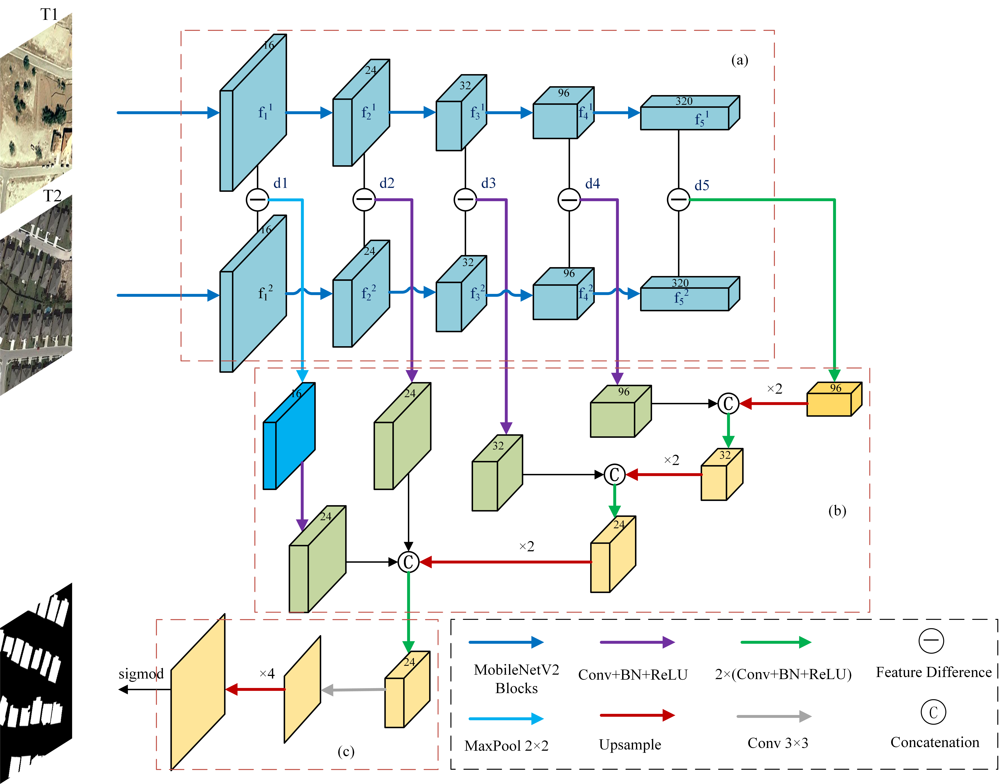
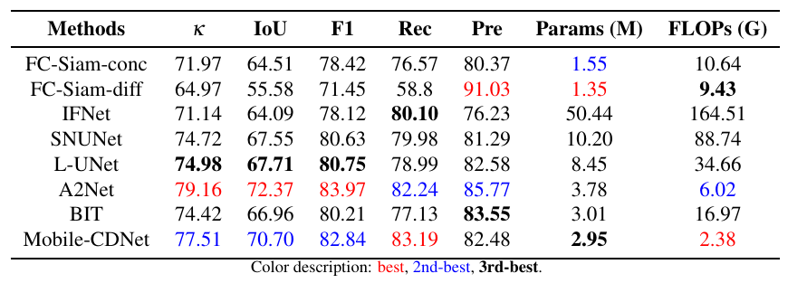
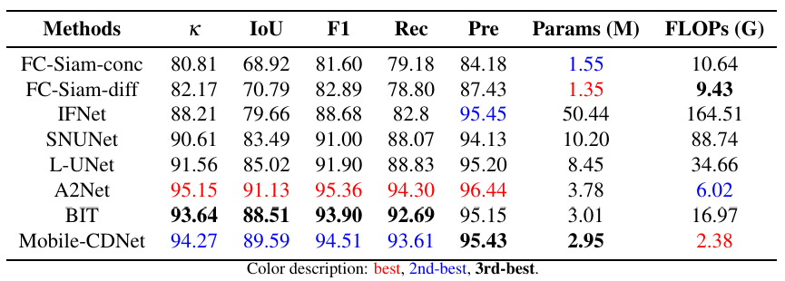
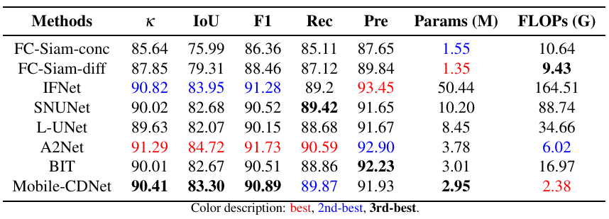
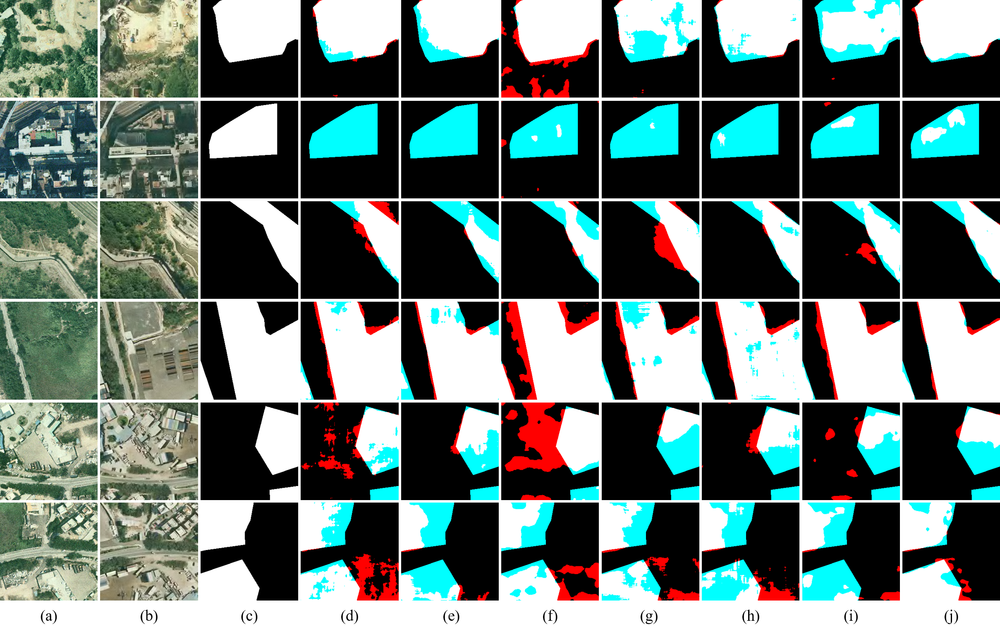
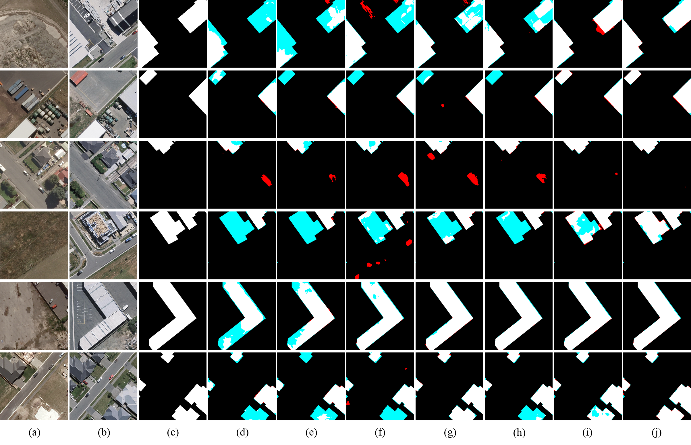
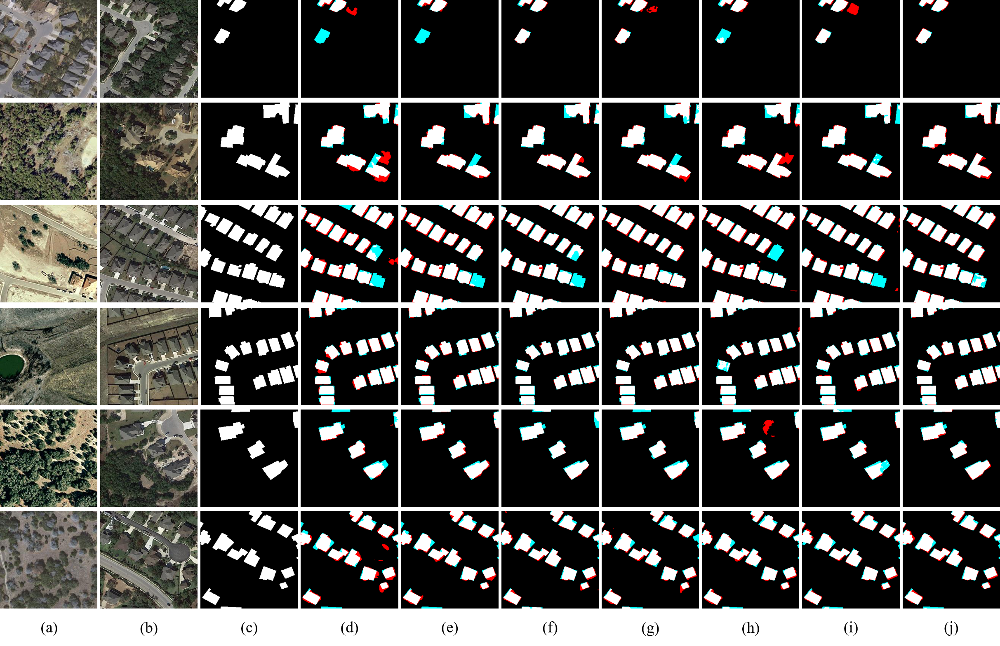

# <p align=center>`Mobile-CDNet: Lightweight Remote Sensing Change DetectionWith Progressive Difference Feature Aggregation (Scientific Reports)`</p>

> **Authors:**
Yinghua Fu, Haifeng Peng, Tingting Zhao, Yize Li, Jiansheng Peng, Dawei Zhang


### 1. Network

<p align="center">
     <br />
</p>

Overall structure of the Mobile-CDNet. (a) A dual-stream encoder with shared with shared weights. (b)A decoder with multiscale change in feature maps via skip connections. (c) The prediction head. <br>

### 2. DataSet
+ Prepare the data:
    - Download datasets [LEVIR](https://justchenhao.github.io/LEVIR/), [BCDD](https://study.rsgis.whu.edu.cn/pages/download/building_dataset.html), and [SYSU](https://github.com/liumency/SYSU-CD)
    - Then, for each dataset, you have to organise the data in the following way:

    ```
    `A`: images of t1 phase;

    `B`: images of t2 phase;

    `label`: label maps;

    `list`: contains `train.txt`, `val.txt` and `test.txt`, each file records the image names (XXX.png) in the change detection dataset.
    ```
### 3. Usage
+ pepare environments:
    - Creating a virtual environment in the terminal: `conda create -n MobileCDNet python=3.8`
    - Install torch==1.8.0

+ Run Shell
    - `sh ./tools/train.sh`
    - `sh ./tools/test.sh`

### 4. Change Detection Results
<p align="center">
     <br />
    <em> 
    Quantitative comparison on SYSU-CD
    </em>
</p>
<p align="center">
     <br />
    <em> 
    Quantitative comparisons on BCDD
    </em>
</p>
<p align="center">
     <br />
    <em> 
    Quantitative comparisons on LEVIR-CD
    </em>
</p>
<p align="center">
     <br />
    <em> 
    Visual comparisons on SYSU-CD
    </em>
</p>
<p align="center">
     <br />
    <em> 
    Visual comparisons on BCDD
    </em>
</p>
<p align="center">
     <br />
    <em> 
    Visual comparisons on LEVIR-CD
    </em>
</p>

### 5. License
Code is released for non-commercial and research purposes only. For commercial purposes, please contact the authors.


